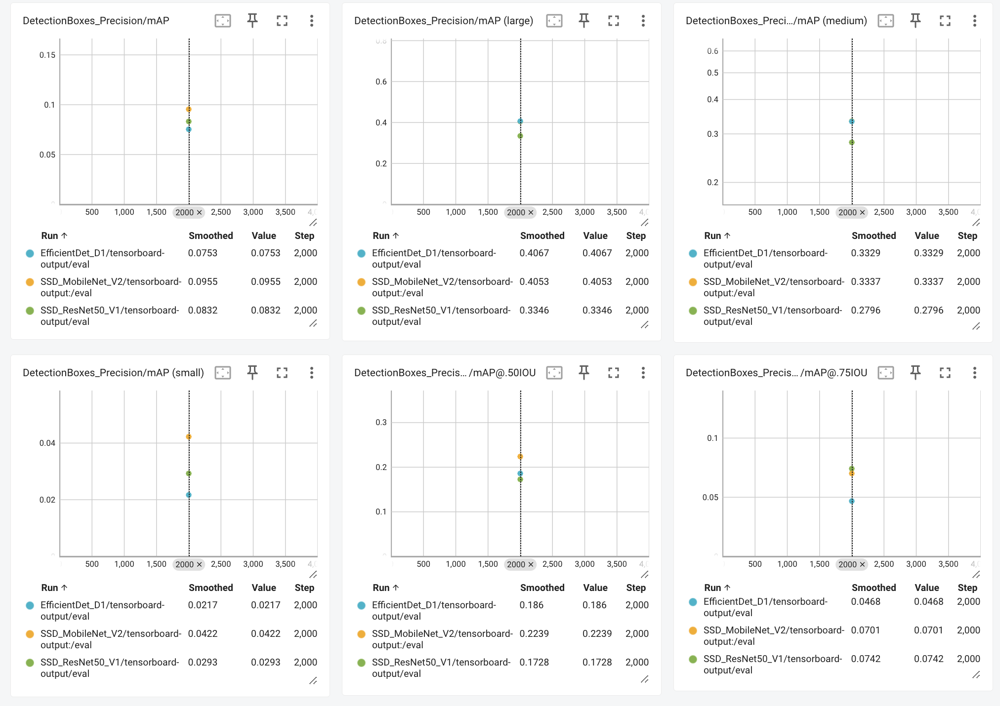
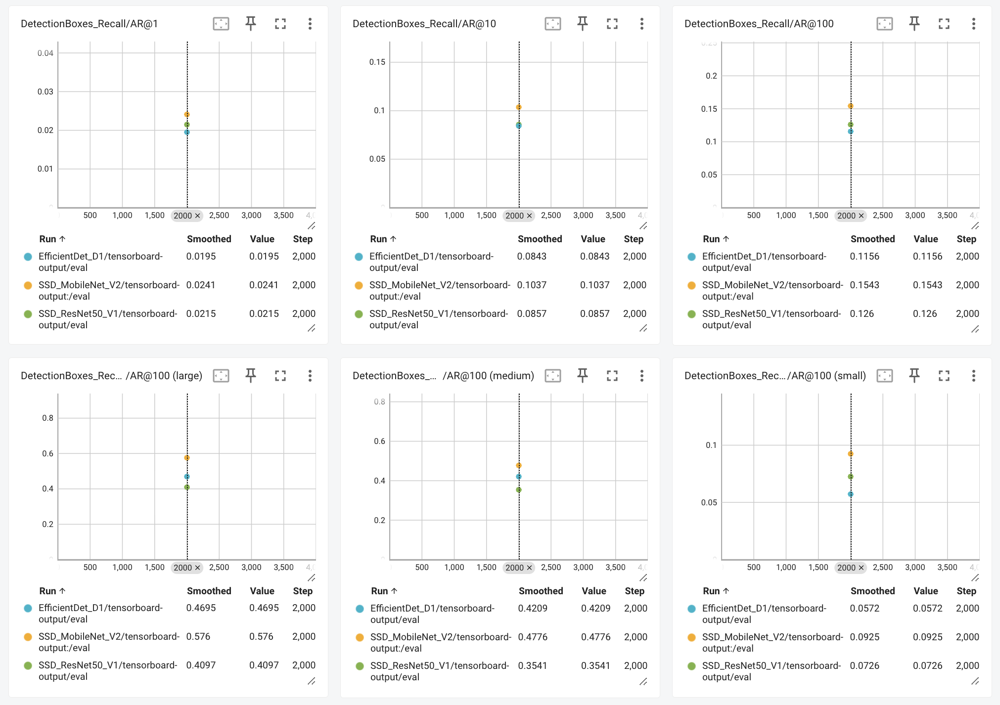
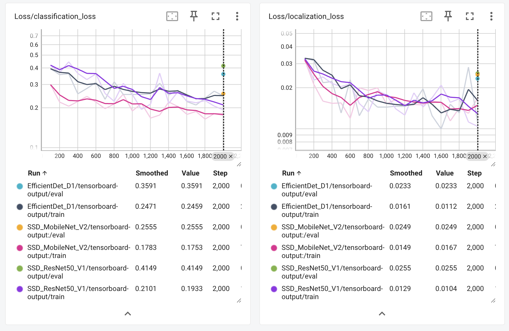
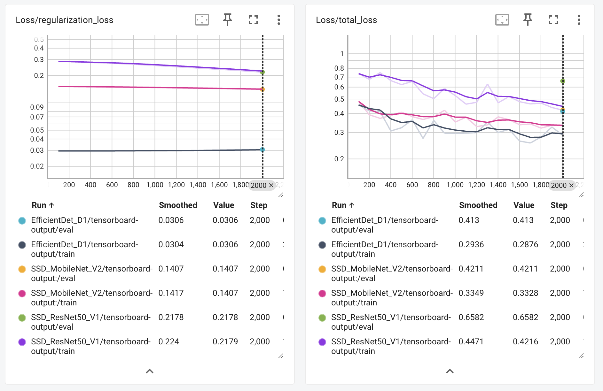

# Project Results

## Steps

- Model Training
    - In `1_train_model.ipynb`, three different models were trained with the following in folder `source_dir`:
        - EfficientDet D1 640x640
        - SSD MobileNet V2 FPNLite 640x640
        - SSD ResNet50 V1 FPN 640x640 (RetinaNet50)
    - The tensorboard logs were downloaded from the S3 bucket.
- Model Inference
    - In `2_deploy_model.ipynb`, the inference results on the `test_video` folder were generated by changing the `model_artifact` path.

## Evaluation

**Experiments Summary**

 - mAP metric: As can be seen from the mAP metric results, by using the default parameters from each model's configuration file, SSD MobileNet v2 demonstrates a highest overall mAP at 0.0955. The results are intereseting since EfficientDet D1 has more advanced backbone, which should delivers better accuracy, particularly for more complex object detection tasks. This could be due to the overfitting, which will be discussed in the loss metric. However, it can be mitigated by using augmentation techniques and other regulation methods.

 - Recall metric: Similar to the mAP metric, SSD MobileNet v2 also demonstrates better performance.

 In summary, SSD MobileNet v2 performs well, especially considering its simpler architecture. On the other hand, SSD ResNet50 v1 faces considerable challenges across all metrics, particularly with small objects, suggesting that the architecture may not be well-suited to the dataset. EfficientDet-D1 is expected to provide better performance, which could be further enhanced by incorporating data augmentation techniques.

**How does the validation loss compare to the training loss?**

In the above figure, we can see
 - Classification Loss: All the models have higher vlidation loss comparing to the training loss, which indicating potential overfitting.
 - Localization Loss: Sames as classification loss, validation loss higher than training loss, which suggesting potential overfitting, particular for SSD MobileNet V2 and SSD ResNet50 V1.

Regarding the regularization and total loss:
 - Regularization Loss: All the validation loss across models showing slightly lower than the training loss, suggesting model's complexity achieved good balance.
 - Total Loss: This is the combination of all the above losses, showing overfitting across all the models. It it noted that SSD ResNet50 V1 shows larger overfitting gap comparing with the other two models.

**Did you expect such behavior from the losses/metrics?**
 - Yes, I expect such behavior since overfitting the models should be the first step to make sure the models have the ability to learn from the data effectively.
 - Once the model shows the ability to overfit, regularization techniques (like L2 regularization, dropout, etc.) are applied to control this overfitting. The goal is to find a balance where the model is complex enough to learn the important features but not so complex that it memorizes the training data. This process ensures that the model generalizes well to unseen data.

**What can you do to improve the performance of the tested models further?**

  - Data augmentation: Increase the variability in the training set by applying transformations (rotation, flipping, scaling, cropping, color jittering, etc.) can mitigate the overfitting and help the model generalize better performance to unseen data.
  - Hyperparameter Tuning: Adjust the hyperparameters such as learning rate, batch size, and reularization parameters to improvde the model performance.
  - Training strategies: Apply learning rate schedulers or early stopping to make the model converge to a better solution.
  - Model architecture adjustments: Consider switching to a more suitable backbone. For example, we can decrese the backbone model complexity for SSD ResNet50 v1.

## Inference Results

The inference results are located in the folder `2_run_inference`.
